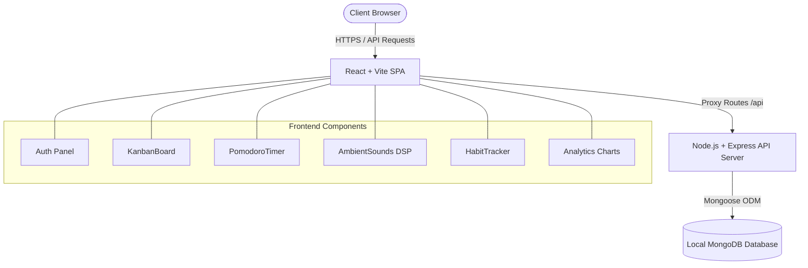

# 🌌 ZenSpace — Glassmorphic Flow State Sanctuary

ZenSpace is a premium, full-stack MERN (MongoDB, Express, React, Node) application designed as an aesthetic personal productivity sanctuary. It combines a native drag-and-drop Kanban task board, a Pomodoro focus timer, a daily habit tracker, an ambient sound generator, and detailed productivity charts into a cohesive, glassmorphic dashboard.

---

## 🎨 Design System & Aesthetics
ZenSpace is styled from scratch with **Vanilla CSS variables** to create a highly premium, futuristic "glassmorphism" look.
- **Glassmorphic Cards**: Translucent backgrounds (`rgba(255, 255, 255, 0.03)`), backdrop filters (`blur(20px)`), and fine borders (`rgba(255, 255, 255, 0.08)`).
- **Vibrant Accents**: High-saturation neon glows (deep purple, violet, cyan, electric pink).
- **Micro-Animations**: Custom CSS keyframes for fade-ins, loading states, sliding transitions, and interactive scale transformations.
- **Celebration Feedback**: Integrated fireworks confetti explosion using `canvas-confetti` when focus goals or habits are completed.

---

## 🚀 Key Features

### 1. 📂 Kanban Task Workspace
A fully functional, native drag-and-drop board for organizing tasks:
- **Columns**: "To Do", "In Progress", and "Done".
- **Interaction**: Drag cards between columns using HTML5 Drag and Drop API with smooth visual feedback and database persistence.
- **Metadata**: Add detailed descriptions, select categories (e.g., Coding, Design, Review), and prioritize using colored priority badges (Low, Medium, High).

### 2. ⏱️ Pomodoro Focus Timer
A customizable countdown timer designed to push users into deep focus:
- **Interactive SVG Progress Ring**: Features a glowing circular stroke gradient that animates in sync with the ticking timer.
- **Interval Modes**: Focus (25m), Short Break (5m), and Long Break (15m).
- **Analytics Sync**: Automatically logs completed focus cycles to the database with category tags (e.g. Coding, Design, Planning).
- **Audio Feedback**: Uses the browser's audio synthesizer to play completion tones.

### 3. 🎧 DSP Synthesized Ambient Soundboard
A highly technical soundboard utilizing the **Web Audio API** to generate high-fidelity ambient loops client-side, with zero network loading latency or CORS issues:
- **Celestial Rain**: Synthesizes rain by generating a white noise buffer and feeding it through highpass and lowpass filters.
- **Cosmic Waves**: Generates white noise and automates lowpass filter sweeps using a Low Frequency Oscillator (LFO) to simulate rolling ocean waves.
- **Binaural Focus**: Plays detuned sine waves (100Hz Left, 104Hz Right) hard-panned to create a 4Hz Theta beat, inducing focus and flow.
- **Mixer**: Adjust volume levels of individual sounds independently using slider nodes.

### 4. 📅 Habit Rituals Matrix
A checklist designed to help developers establish daily rituals:
- **Rolling Weekly Grid**: Displays the last 7 calendar days dynamically calculated in the user's local timezone.
- **Streaks**: An automated streak engine that calculates consecutive days completed.
- **One-Click Checkmarks**: Interactive tick buttons with immediate database synchronization.

### 5. 📈 Flow Insights (Analytics Dashboard)
A complete personal metrics panel powered by `Chart.js` and `react-chartjs-2`:
- **Weekly Bar Chart**: Visualizes daily focus minutes completed over the last 7 days.
- **Category Doughnut Chart**: Displays focus distribution percentages across your categories.
- **Quick Metrics**: Instantly shows total focus minutes, total focus sessions, and task completion ratios.

---

## 🛠️ Architecture & Tech Stack



- **Frontend**: React (SPA), Vite (Bundler), Vanilla CSS (Themes & Styles), Lucide React (Icon System), Chart.js (Data rendering), Canvas Confetti (Celebration).
- **Backend**: Node.js, Express (REST API), JSON Web Token (JWT session validation), BcryptJS (Password hashing), Mongoose (Data modeling).
- **Database**: MongoDB (Local or Atlas Cloud).

---

## ⚙️ Schema Specifications

### User Schema
Stores credential details and custom preferences:
- `username` (Unique string)
- `email` (Unique string)
- `password` (Hashed string)
- `settings`: `{ timerDuration, shortBreak, longBreak, theme }`

### Task Schema
Keeps track of Kanban items:
- `title` (String)
- `description` (String)
- `status` (`todo`, `in_progress`, `done`)
- `priority` (`low`, `medium`, `high`)
- `category` (String)
- `user` (Reference to User model)

### Habit Schema
Stores logs of weekly rituals:
- `title` (String)
- `completedDates` (Array of `YYYY-MM-DD` strings)
- `streak` (Auto-calculated number)
- `user` (Reference to User model)

### FocusSession Schema
Tracks focus periods for charting:
- `user` (Reference to User model)
- `duration` (Minutes)
- `category` (Coding, Design, Planning, Learning, Review, Other)
- `createdAt` (Timestamp)

---

## 🚀 Setup & Installation

Follow these steps to boot the application on your computer:

### Prerequisites
1. **Node.js** (v16+ recommended)
2. **MongoDB** (Started locally, e.g., via `net start MongoDB`)

### 1. Backend Setup
1. Open a terminal and navigate to the backend folder:
   ```bash
   cd backend
   ```
2. Install dependencies:
   ```bash
   npm install
   ```
3. Boot the API server (runs on port 5000):
   ```bash
   npm run dev
   ```

### 2. Frontend Setup
1. Open a second terminal window and navigate to the frontend folder:
   ```bash
   cd ../frontend
   ```
2. Install dependencies:
   ```bash
   npm install
   ```
3. Start the Vite server (runs on port 3000):
   ```bash
   npm run dev
   ```

### 3. Open Sanctuary
Open your browser and navigate to:
👉 **[http://localhost:3000](http://localhost:3000)**
